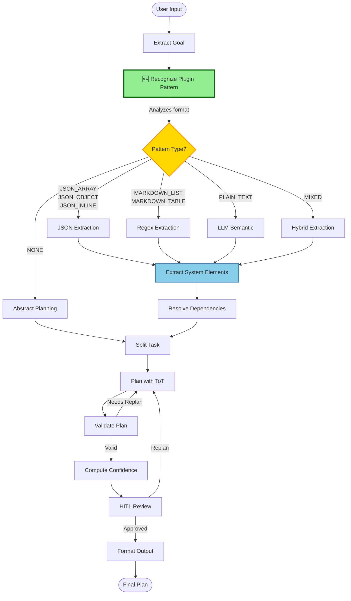
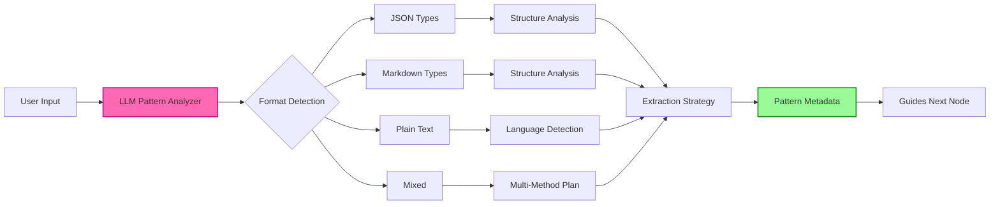

# Enhanced Workflow with Pattern Recognition

## Complete Flow Diagram



## Pattern Recognition Detail



## Before vs After

### Before (Old Flow)
```
[extract_goal] → [extract_system_elements] → [resolve_dependencies] → ...
                  ↓
                  Try LLM
                  ↓ (if fails)
                  Try JSON
                  ↓ (if fails)
                  Try Regex
                  ↓ (if fails)
                  Give up
```

### After (New Flow with Pattern Recognition)
```
[extract_goal] → [recognize_plugin_pattern] → [extract_system_elements] → ...
                         ↓                              ↓
                   Detects: JSON_ARRAY           Uses: json.loads()
                   Confidence: 0.95              Success in 1 try!
```

## Pattern Analysis Flow

```
┌─────────────────────────────────────────────────────────────┐
│ 1. User Input                                               │
│    "[{"name":"plugin1"}, {"name":"plugin2"}]"              │
└─────────────────┬───────────────────────────────────────────┘
                  │
                  ▼
┌─────────────────────────────────────────────────────────────┐
│ 2. LLM Analyzes Input                                       │
│    - Checks syntax patterns                                 │
│    - Detects structure                                      │
│    - Identifies language                                    │
└─────────────────┬───────────────────────────────────────────┘
                  │
                  ▼
┌─────────────────────────────────────────────────────────────┐
│ 3. Pattern Metadata Generated                               │
│    {                                                        │
│      "format_type": "JSON_ARRAY",                          │
│      "structure_pattern": "flat_array",                    │
│      "language": "english",                                │
│      "extraction_strategy": "json_parse",                  │
│      "confidence": 0.95,                                   │
│      "has_plugins": true                                   │
│    }                                                        │
└─────────────────┬───────────────────────────────────────────┘
                  │
                  ▼
┌─────────────────────────────────────────────────────────────┐
│ 4. Extraction Node Uses Pattern                            │
│    if pattern["format_type"] == "JSON_ARRAY":              │
│        plugins = json.loads(input)  # Direct parse         │
│    elif pattern["format_type"] == "PLAIN_TEXT":            │
│        plugins = llm_extract(input)  # Semantic            │
└─────────────────┬───────────────────────────────────────────┘
                  │
                  ▼
┌─────────────────────────────────────────────────────────────┐
│ 5. Successful Extraction                                    │
│    plugins: [{"name": "plugin1"}, {"name": "plugin2"}]     │
│    system_elements: ["plugin1: ...", "plugin2: ..."]      │
└─────────────────────────────────────────────────────────────┘
```

## State Evolution

```
Initial State:
├── messages: [HumanMessage(...)]
└── goal: ""

After extract_goal:
├── messages: [...]
└── goal: "extracted goal text"

After recognize_plugin_pattern: 🆕
├── messages: [...]
├── goal: "..."
├── plugin_definition_pattern: {format, strategy, ...}
└── pattern_confidence: 0.95

After extract_system_elements:
├── messages: [...]
├── goal: "..."
├── plugin_definition_pattern: {...}
├── pattern_confidence: 0.95
├── plugins: [{name, goal, type}, ...]
├── system_elements: ["plugin1: ...", ...]
└── has_system_elements: true

After resolve_dependencies:
├── ...all above...
├── plugin_dependencies: {"A": ["B", "C"]}
└── dependency_order: ["B", "C", "A"]
```
